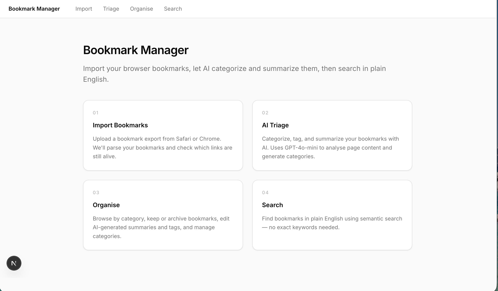

# Bookmark Manager (built by OpenAI Codex)

> **Note:** This build does not work. It will import and categorise your bookmarks (with mixed results), but the search feature — the whole point of the app — is broken. If you're following the Built Twice series on LinkedIn, that's part of the story: not every AI-assisted build goes smoothly. If you'd like to try a working version, head over to the [Bookmark Manager built by Claude Code](https://github.com/just-code-in/bookmark-manager-claude).

**Import your browser bookmarks, let AI categorise and summarise them, then search in plain English.**

If you have hundreds (or thousands) of browser bookmarks accumulated over the years — some useful, many forgotten, plenty dead — this app makes sense of them. It runs locally on your machine, uses AI to organise everything, and lets you find what you need by describing it in ordinary language rather than guessing the right keyword.

No accounts. No cloud. No deployment. You run it on your computer, in your browser.

---

## What it does

The app has four features, each built around a different stage of dealing with a messy bookmark collection:

1. **Import** — Upload a bookmark export from Safari or Chrome. The app parses every bookmark and checks which links are still alive, which redirect, and which are dead.

2. **AI Triage** — An AI model (GPT-4.1-mini via OpenAI) reads each bookmark, categorises it, generates tags, and writes a short summary. Categories aren't predefined — the AI infers a taxonomy from your actual collection. Dead links are categorised from their URL and title alone.

3. **Organise** — Browse by category, keep or archive bookmarks, rename or merge categories, edit AI-generated summaries and tags. Bulk actions and category overrides let you work through hundreds at a time.

4. **Search** — Find bookmarks by describing what you're looking for in everyday language. The app understands meaning, not just keywords — so "that article about productivity systems I saved last year" will find it, even if the word "productivity" doesn't appear anywhere in the title or URL.



---

## Getting started

Running this app will give you a genuinely useful tool for your bookmarks — but it will also give you something broader: confidence in using GitHub as a source for software that people share openly. Most projects on GitHub follow exactly this pattern (clone, install, run), so once you've done it once, the next one feels familiar.

If any of the steps below are new to you, don't worry. Step-by-step guides are included that assume no prior development experience and walk through everything from scratch.

### Guides

These are written for people who haven't done this before. If terms like "terminal" or "API key" aren't part of your everyday vocabulary, start here — they'll take you through the whole process at a comfortable pace.

- **[Getting Started](https://github.com/just-code-in/bookmark-manager-codex/blob/main/docs/getting-started-codex.md)** — step-by-step walkthrough from installation to your first import
- **[Your First API Key](https://github.com/just-code-in/bookmark-manager-codex/blob/main/docs/your-first-api-key-codex.md)** — how to get an OpenAI API key and connect it to the app (required for AI Triage and Search)

### Check you have Node.js

This is the only prerequisite. Node.js is the engine that runs the app on your computer — you install it once and then forget about it. It's widely used, completely free, and the installation is a standard point-and-click installer like any other application.

Open a terminal — on Mac, open the **Terminal** app (search for it in Spotlight with ⌘+Space); on Windows, open **Command Prompt** (search for it in the Start menu) — and run:

```bash
node -v
```

If that returns a version number (v18 or higher), you're set. If not, download it from [nodejs.org](https://nodejs.org) — choose the LTS version and follow the installer. Once it's done, run `node -v` again to confirm.

### Setup

You'll also need an **OpenAI API key** for the AI features (Triage and Search). The [Your First API Key](https://github.com/just-code-in/bookmark-manager-codex/blob/main/docs/your-first-api-key-codex.md) guide covers this in detail — you can set it up now or after your first import.

```bash
git clone https://github.com/just-code-in/bookmark-manager-codex.git
cd bookmark-manager-codex
npm install
cp .env.example .env
# Open .env and add your OpenAI API key
npm run dev
```

Then open [http://localhost:5173](http://localhost:5173) in your browser. This is a local address — the app is running on your own computer, not on the internet. It looks and feels like a website, but nothing leaves your machine. If you see the app's home screen, you're up and running.

---

## The Built Twice project

This app was built as part of **Built Twice** — a project where the same specification was given to two different AI coding tools (Claude Code and OpenAI Codex) to see how they'd each approach it. Same problem, same requirements, different implementations.

This is the **Codex build**. The Claude Code build is here: [bookmark-manager-claude](https://github.com/just-code-in/bookmark-manager-claude).

Both repos share an identical [Product Requirements Document](https://github.com/just-code-in/bookmark-manager-claude/blob/main/PRD.md) as their starting point.

---

## How it was built

You don't need to understand any of this to use the app — this section is here for anyone curious about what's under the hood.

| Layer | Technology |
|-------|-----------|
| Frontend | React + Vite |
| Backend | Fastify |
| Database | SQLite |
| Shared types | TypeScript (monorepo with shared package) |
| AI | OpenAI GPT-4.1-mini (categorisation + summaries) |
| Search | text-embedding-3-small embeddings, in-memory cosine similarity |
| Validation | Zod schemas, worker-based batch processing |

### Project structure

(These are the folders the app creates on your computer when you clone the repository. You won't need to open or edit any of them — this is just a map of how things are organised internally.)

```
bookmark-manager-codex/
├── apps/
│   ├── web/              # React + Vite frontend
│   └── api/              # Fastify backend
├── packages/
│   └── shared/           # Shared TypeScript types
├── db/                   # SQLite database and migrations
└── docs/
    └── architecture.md   # Technical decisions and stack overview
```
