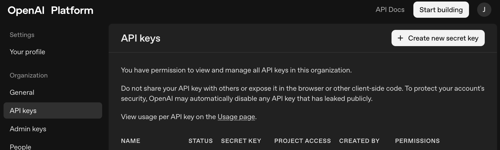
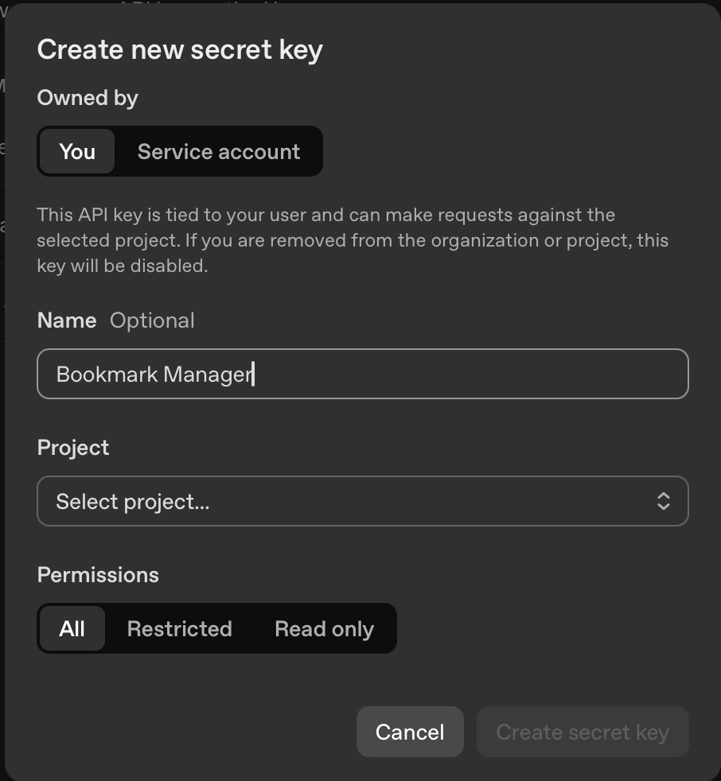
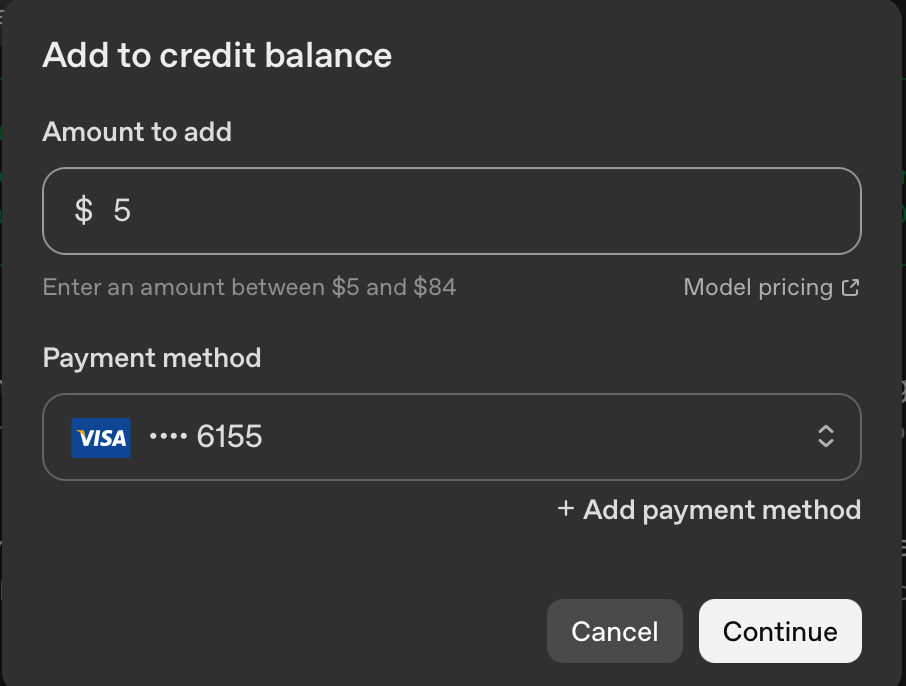
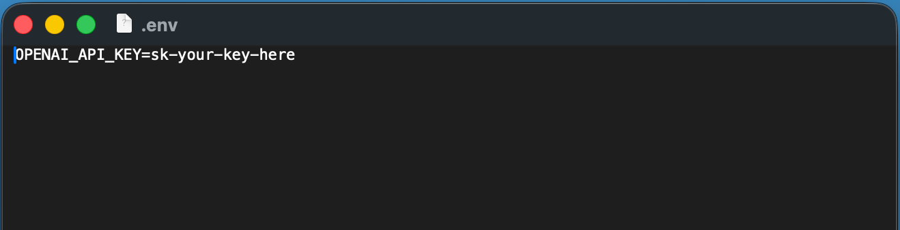

# Your First API Key

## Connecting the AI

The import phase works without any external services — your computer does everything. The triage phase is different. To categorise and summarise your bookmarks, the app needs access to an AI service. This means getting an API key.

An API key is like a password that lets the app talk to an AI service on your behalf. You'll copy it from the provider's website, paste it into a settings file, and the app handles the rest. It takes about five minutes.

> [!NOTE]
> The AI service isn't free — it charges a small amount for each request. For a collection of around 1,000 bookmarks, you're looking at roughly $1–3 in total. The app logs every request and its cost, so you'll know exactly what you've spent.

---

### Which provider do I need?

This build uses **OpenAI**. You'll need an OpenAI API key — the steps below walk you through getting one.

---

### Getting an OpenAI API key

1. Go to [platform.openai.com](https://platform.openai.com) and create an account (or sign in if you already have one — a ChatGPT account works)
2. Once you're in, click **API keys** in the left sidebar (or go directly to [platform.openai.com/api-keys](https://platform.openai.com/api-keys))
3. Click **Create new secret key**
4. Give it a name you'll recognise — something like "Bookmark Manager" is fine
5. Copy the key immediately. You won't be able to see it again after you close this window



*Click "Create new secret key." That's it — no configuration, no settings to worry about.*



*Give it a name you'll recognise. "Bookmark Manager" works perfectly.*

> [!IMPORTANT]
> You'll need to add credit to your OpenAI account before the key will work. Go to **Settings → Billing** and add a payment method. $5 is more than enough for this project — you can always add more later. Set a usage limit if you'd like peace of mind.



*Add $5 of credit and set a usage limit. You'll spend well under a dollar on this project — the limit is just peace of mind.*

---

### Adding the key to the app

This is the part that sounds technical but is genuinely just copying and pasting into a text file.

**Step 1:** In your terminal, make sure you're in the project folder:

| | Copy and paste |
|---|---|
| **Mac** | `cd ~/Projects/bookmark-manager-codex` |
| **Windows** | `cd %USERPROFILE%\Projects\bookmark-manager-codex` |

**Step 2:** Create the settings file. This is a file called `.env` — the dot at the start means it's hidden, which is a convention for configuration files that contain sensitive information like API keys.

| | Copy and paste |
|---|---|
| **Mac** | `cp .env.example .env` |
| **Windows** | `copy .env.example .env` |

> [!NOTE]
> If there's no `.env.example` file yet, you can create one directly. Create a new file called `.env` in the project folder and add this line:
>
> ```
> OPENAI_API_KEY=sk-your-key-here
> ```

**Step 3:** Open the `.env` file in a text editor and paste your API key in place of the placeholder text.

| | How to open it |
|---|---|
| **Mac** | `open .env` (opens in your default text editor) or `nano .env` (edits right in the terminal) |
| **Windows** | `notepad .env` |

Replace `sk-your-key-here` with the key you copied from OpenAI. Save the file and close it.



*The whole file is one line. Paste your key, save, done. The app picks it up automatically.*

> [!WARNING]
> **Never share your API key.** Don't paste it into messages, emails, or public documents. The `.env` file is automatically excluded from GitHub (via a file called `.gitignore`), so your key won't be uploaded if you push changes. But it's good practice to treat it like a password.

**Step 4:** Start the app as normal:

```
npm run dev
```

The app will pick up the key from the `.env` file automatically. You're ready to run triage.

---

### What this costs

The app logs every AI request it makes, so you can see exactly what you're spending. For context:

| Model | Approximate cost per 1,000 bookmarks |
|-------|--------------------------------------|
| GPT-4.1-mini (used by this build) | ~$0.50–1.00 |

This is a rough estimate — actual costs depend on how much content each bookmark's page contains. The app will show you the real numbers as it runs.

> [!TIP]
> Start with a smaller batch if you want to see what it looks like before committing to the full run.

---

*These costs will be reported honestly in the Built Twice series — they're part of the story.*
